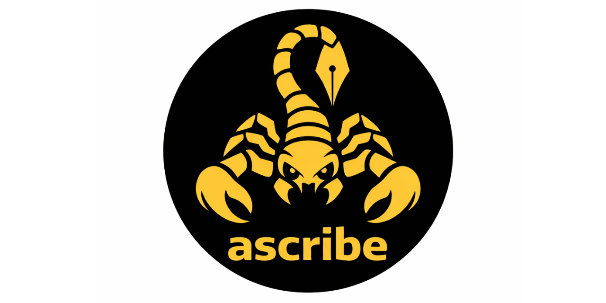

<div align="center">
  
</div>

# ascribe

[](https://github.com/Eleven19/ascribe/actions/workflows/ci.yml)
[](https://central.sonatype.com/artifact/io.eleven19.ascribe/ascribe-core_3)

**[Documentation](https://eleven19.github.io/ascribe/)** | **[API Reference](https://eleven19.github.io/ascribe/io/eleven19/ascribe.html)** | **[Getting Started](https://eleven19.github.io/ascribe/docs/getting-started.html)**

Ascribe is an AsciiDoc library and toolchain for Scala 3. It provides parsers, an AST, an Abstract Semantic Graph (ASG), and a processing pipeline for AsciiDoc documents.

Built against the [AsciiDoc Language Specification](https://gitlab.eclipse.org/eclipse/asciidoc-lang/asciidoc-lang) and validated with the [AsciiDoc TCK](https://gitlab.eclipse.org/eclipse/asciidoc-lang/asciidoc-tck).

## Modules

| Module | Artifact | Description |
|--------|----------|-------------|
| Core | `ascribe-core` | Parser, AST, and DSL for AsciiDoc documents |
| Umbrella | `ascribe` | Optional convenience aggregate (core + pipeline + HTML + Markdown + ASG + bridge) |
| Pipeline (core) | `ascribe-pipeline-core` | Shared pipeline types, `PipelineOp`, pure rewrites |
| Pipeline (Kyo) | `ascribe-pipeline-kyo` | Kyo-backed pipeline, file I/O, includes |
| Pipeline (Ox) | `ascribe-pipeline-ox` | Direct-style Ox pipeline (`Either[PipelineError, *]`), file I/O, includes—parity with the Kyo module |
| HTML | `ascribe-pipeline-html` | scalatags HTML output |
| Markdown | `ascribe-pipeline-markdown` | GFM via zio-blocks-docs (best-effort) |
| ASG | `ascribe-asg` | Abstract Semantic Graph matching the AsciiDoc TCK schema |
| Bridge | `ascribe-bridge` | AST-to-ASG converter |

**Repository layout:** Mill modules are nested under [`ascribe/`](ascribe/) (for example `ascribe/core/` → `ascribe.core`, `ascribe/pipeline/kyo/` → `ascribe.pipeline.kyo`). Maven coordinates use hyphenated `artifactName` values as in the table above.

**Migration:** the former parser artifact `ascribe` was split: use `ascribe-core` for the parser only, or the new `ascribe` umbrella for a single dependency that pulls the supported stack (without Kyo/Ox unless you add those artifacts).

## Installation

### Mill

```scala
def mvnDeps = Seq(
  mvn"io.eleven19.ascribe::ascribe:0.2.1",
  mvn"io.eleven19.ascribe::ascribe-pipeline-kyo:0.2.1"
)
```

### sbt

```scala
libraryDependencies ++= Seq(
  "io.eleven19.ascribe" %% "ascribe"             % "0.2.1",
  "io.eleven19.ascribe" %% "ascribe-pipeline-kyo" % "0.2.1"
)
```

### Maven

```xml
<dependency>
  <groupId>io.eleven19.ascribe</groupId>
  <artifactId>ascribe_3</artifactId>
  <!-- Parser-only: use ascribe-core_3; full stack: ascribe_3 umbrella + optional ascribe-pipeline-kyo_3 / ascribe-pipeline-ox_3 -->
  <version>0.2.1</version>
</dependency>
```

## Quick Start

### Parse an AsciiDoc document

```scala
import io.eleven19.ascribe.Ascribe

Ascribe.parse("= Title\n\nParagraph text.\n") match
  case parsley.Success(doc) => println(doc)
  case parsley.Failure(msg) => println(s"Parse error: $msg")
```

### Convert to the Abstract Semantic Graph

The bridge module converts the parser's AST into the ASG, which matches the official AsciiDoc TCK schema:

```scala
import io.eleven19.ascribe.bridge.AstToAsg

val astDoc = Ascribe.parse("= Title\n\nParagraph text.\n").get
val asgDoc = AstToAsg.convert(astDoc)
```

### Encode to JSON

```scala
import io.eleven19.ascribe.asg.AsgCodecs

val json = AsgCodecs.encode(asgDoc)
println(json)
```

### Build documents with the DSL

The `ast.dsl` module provides a concise builder syntax for constructing AST nodes without position boilerplate:

```scala
import io.eleven19.ascribe.ast.dsl.{*, given}
import scala.language.implicitConversions

val doc = document(
  heading(1, text("My Document")),
  paragraph("Hello ", bold("world"), "!"),
  unorderedList(
    listItem("First item"),
    listItem("Second item")
  )
)
```

### Process documents with the pipeline

Use the `ascribe-pipeline-kyo` artifact (in addition to `ascribe-core` or the `ascribe` umbrella). It provides renderers, rewrite rules, and file I/O using [Kyo](https://getkyo.io) effects:

```scala
import io.eleven19.ascribe.pipeline.*
import io.eleven19.ascribe.pipeline.dsl.*

// Parse, remove comments, and render back to AsciiDoc
val result = Pipeline
  .fromString("= Title\n\n// a comment\n\nHello.\n")
  .rewrite(removeComments)
  .runToString

// Or process files from a directory
val pipeline = Pipeline
  .from(FileSource.fromDirectory(inputDir))
  .rewrite(removeComments)

pipeline.runTo(FileSink.toDirectory(outputDir))
```

## Documentation

Full documentation is available at **[eleven19.github.io/ascribe](https://eleven19.github.io/ascribe/)**:

- [Getting Started](https://eleven19.github.io/ascribe/docs/getting-started.html) — installation and first steps
- [Architecture](https://eleven19.github.io/ascribe/docs/architecture.html) — module structure and design
- [Parsing Guide](https://eleven19.github.io/ascribe/docs/guides/parsing.html) — parser usage and AST
- [ASG Guide](https://eleven19.github.io/ascribe/docs/guides/asg.html) — semantic graph model
- [Visitor Guide](https://eleven19.github.io/ascribe/docs/guides/visitor.html) — tree traversal patterns

## License

Apache 2.0
